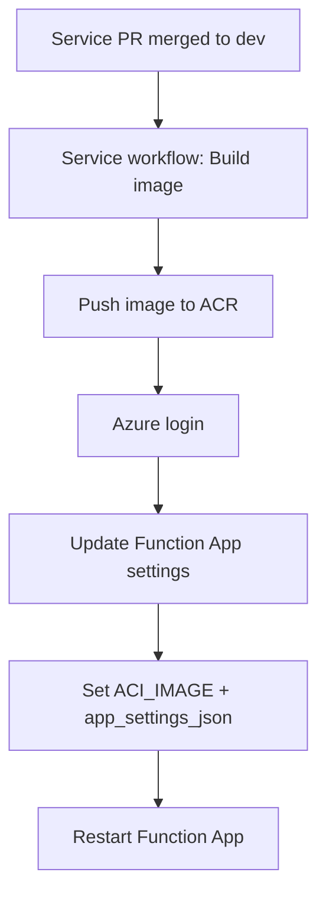
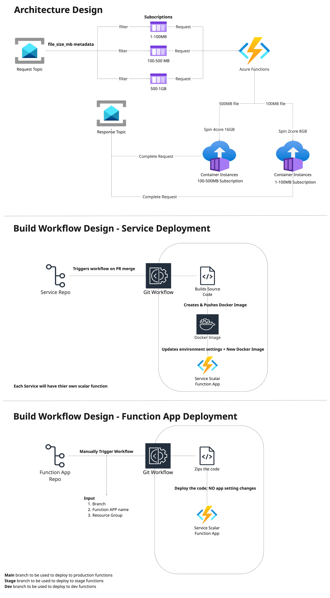

# ACI Scale Management

Timer-triggered Azure Function that peeks Service Bus topic subscriptions and
provisions Azure Container Instances (ACI) sized by message `file_size_mb`
from Service Bus application properties.

## Quick start
1. Create a virtual environment and install dependencies:
   - `python -m venv .venv`
   - `source .venv/bin/activate`
   - `pip install -r requirements.txt`
2. Configure environment variables (see `.env`).
3. Run tests:
   - Unit tests: `pytest -m "not integration" -vv`
   - Integration test: `pytest -m integration -vv`

## Environment variables
See `.env` for a full, working example. Key groups:

- Azure: `AZURE_SUBSCRIPTION_ID`, `AZURE_RESOURCE_GROUP`
- ACI: `ACI_IMAGE`, `ACI_NAME_PREFIX`, `ACI_LOCATION`,
  `ACI_MAX_INSTANCES`, `ACI_DEFAULT_CPU`, `ACI_MEMORY_MULTIPLIER`,
  `ACI_MIN_MEMORY_GB`, `ACI_MAX_MEMORY_GB`
- ACR: `ACR_SERVER`, `ACR_USERNAME`, `ACR_PASSWORD`
- Container diagnostics: `LOG_ANALYTICS_WORKSPACE_ID`,
  `LOG_ANALYTICS_WORKSPACE_KEY` (both must be set to enable ACI diagnostics)
  - Create the Log Analytics workspace in Azure Portal first.
  - To retrieve shared keys (use primary key as `LOG_ANALYTICS_WORKSPACE_KEY`):
    `az monitor log-analytics workspace get-shared-keys --resource-group RESOURCE_GROUP_NAME --workspace-name WORKSPACE_NAME`
- Service Bus:
  - `SB_CONNECTION_STR` (required)
  - `SB_NAMESPACE` (optional if derivable from connection string)
  - `SB_TOPIC_NAME` (required)
- Optional processing control:
  - `SKIP_SUBSCRIPTIONS` (comma-separated subscription names to skip)
  - `PROVISIONING_BATCH_SIZE` (max messages to provision per function invocation, default 10; keeps runs within timeout)
  - `PROVISIONING_MAX_WORKERS` (max parallel provisioning workers per invocation, default 4; independent of subscription count)
  - `PROVISIONING_PEEK_MAX` (max messages to peek per subscription, default 100)
  - `PROVISIONING_CONFIRM_MESSAGE` (confirm message still present before provisioning via peek + message_id match; default true)
  - `PROVISIONING_IN_FLIGHT_MESSAGE_CHECK` (check message presence while ACI provisioning is in progress; default true)
  - `PROVISIONING_IN_FLIGHT_PEEK_MAX` (peek size for in-flight presence check, default 100)
  - `PROVISIONING_IN_FLIGHT_CHECK_INTERVAL_SECONDS` (seconds between in-flight checks, default 1)
  - `PROVISIONING_POST_CREATE_PEEK_MAX` (peek size for post-provision presence check, default 100)
  - `PROVISIONING_POST_CREATE_CONFIRM_CHECKS` (absent checks after provisioning before deleting new container, default 1)
  - `PROVISIONING_POST_CREATE_CONFIRM_INTERVAL_SECONDS` (seconds between post-create checks, default 0)
  - `PROVISIONING_ORPHAN_EMPTY_SUB_PEEK_MAX` (peek size for running-orphan cleanup when subscription appears empty, default 1)
- Container env pass-through:
  - Set any `INSTANCE_*` variables and they will be passed to the container
    without the `INSTANCE_` prefix.
  - `INSTANCE_SUBSCRIPTION_ENV_NAME` sets which env key receives the
    subscription name for service to listen to (e.g. `VALIDATION_REQ_SUB`).

## Service Bus message format
Only Service Bus metadata `message_id` and `file_size_mb` are required.
`file_size_mb` must be supplied as a Service Bus application property
(`application_properties.file_size_mb`).

Example:
```json
{
  "messageId": "5e1a464d-9d69-4e74-871b-474bdc31da20",
  "messageType": "osw_validation_only|osw_validation_only",
  "publishedDate": "2025-03-20T13:18:42.501Z",
  "data": {}
}
```

## How it works
- Lists container groups tagged with `managed_by = ACI_NAME_PREFIX`.
- Splits into active vs terminal groups (terminal = container instance state `Failed` or `Terminated`).
- Skips provisioning if the same `(subscription_name, message_id)` already exists in active container tags (subscription-scoped duplicate detection; `message_id` is normalized to string).
- Peeks messages (does not settle them).
- Provisions in parallel with a thread pool bounded by `PROVISIONING_MAX_WORKERS`.
- Pass 1 provisions at most one message per subscription.
- Pass 2 fills remaining capacity and can run multiple workers even when all work is in a single subscription.
- Filters out subscriptions listed in `SKIP_SUBSCRIPTIONS`.
- Creates an ACI group per message with tags:
  `managed_by`, `message_id`, `file_size_mb`, `subscription_name`.
- When both `LOG_ANALYTICS_WORKSPACE_ID` and `LOG_ANALYTICS_WORKSPACE_KEY` are set,
  ACI diagnostics are enabled with `ContainerInsights` log type.
- While waiting on ACI provisioning, periodically re-checks whether the message is still present; if absent, deletes the container group and stops waiting.
- After provisioning success, re-checks message presence and deletes the newly created container if the message is already gone.
- Deletes containers only when both container instance state and provisioning state are terminal (e.g. container `Failed`/`Terminated` and provisioning `Succeeded`/`Failed`/`Terminated`).
- Deletes running containers as orphan only when tagged `subscription_name` is empty (no messages peeked) while the container is still `Running`.
- Captures the last 20 log lines from each container before deletion.

## Integration test
The integration test sends one or more messages to the topic (file sizes are
passed as Service Bus application properties), waits for provisioning, verifies
memory sizing, waits for terminal state, then confirms container deletion.

Configure the message template:
- `TEST_MESSAGE_JSON_PATH` (default: `tests/data/integration_message.json`)

Run:
- `pytest -m integration -vv`
- `pytest -m "not integration" -vv`

- `pytest -m integration tests/test_integration_e2e.py --e2e-file-sizes 50,180,500,1024 --e2e-expected-subscriptions 1-50MB,51-200MB,201-600MB,601-1GB --e2e-timeout-seconds 900`
  
  The values are mapped by position: `50 -> 1-50MB`, `180 -> 51-200MB`,
  `500 -> 201-600MB`, and `1024 -> 601-1GB`. Keep both comma-separated lists
  in the same order and with the same number of entries.

## Function timeout
The timer function timeout is set to **20 minutes** in `host.json` (`functionTimeout`: `00:20:00`). Provisioning is capped at **`PROVISIONING_BATCH_SIZE`** (default 10) messages per invocation so each run stays within the timeout. If runs still time out, use a **Premium or Dedicated** plan or lower the batch size / `ACI_MAX_INSTANCES`.

## Deploy scaler code (manual)
`.github/workflows/deploy-scaler-code.yml` deploys this repo to the Function App
via manual `workflow_dispatch`.

Inputs:
- `function_app_name` (required)
- `resource_group` (required)

Secret:
- `TDEI_CORE_AZURE_CREDS`

Note: code deployment does not modify Function App settings.

## Service & Scalar Integration Flow Diagram



## Scalar Architecture Overview 

